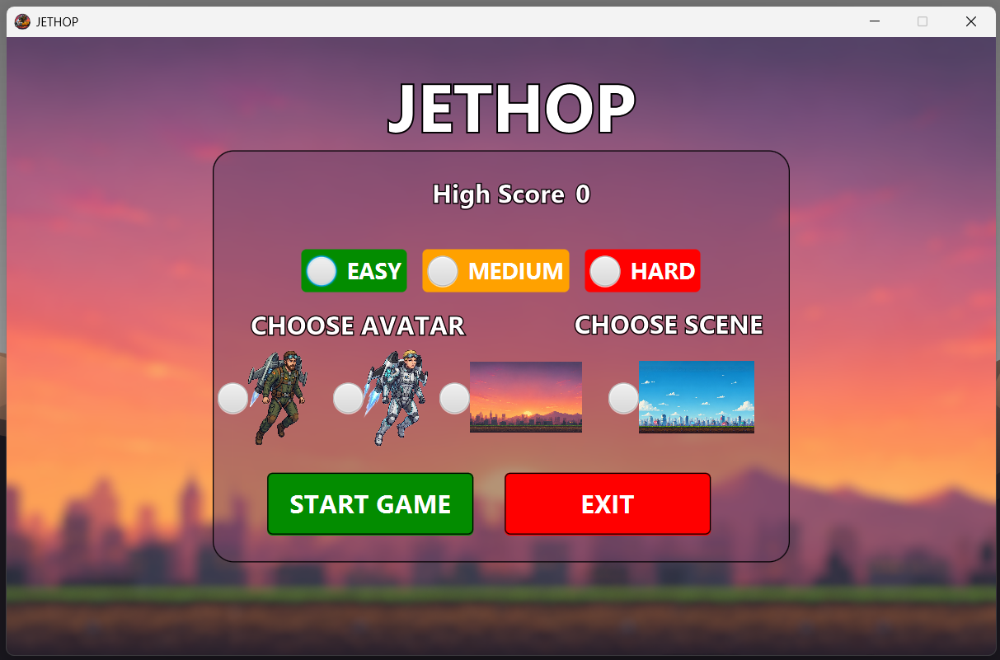
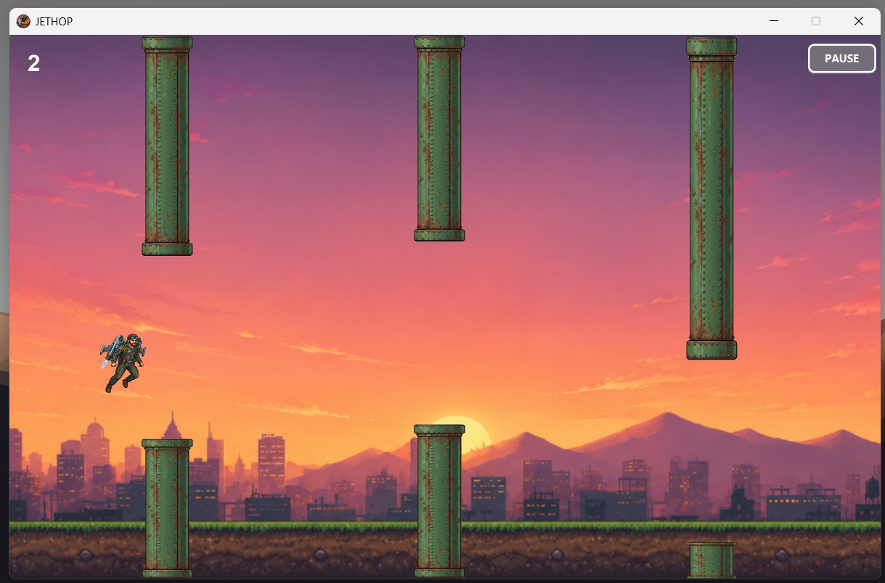
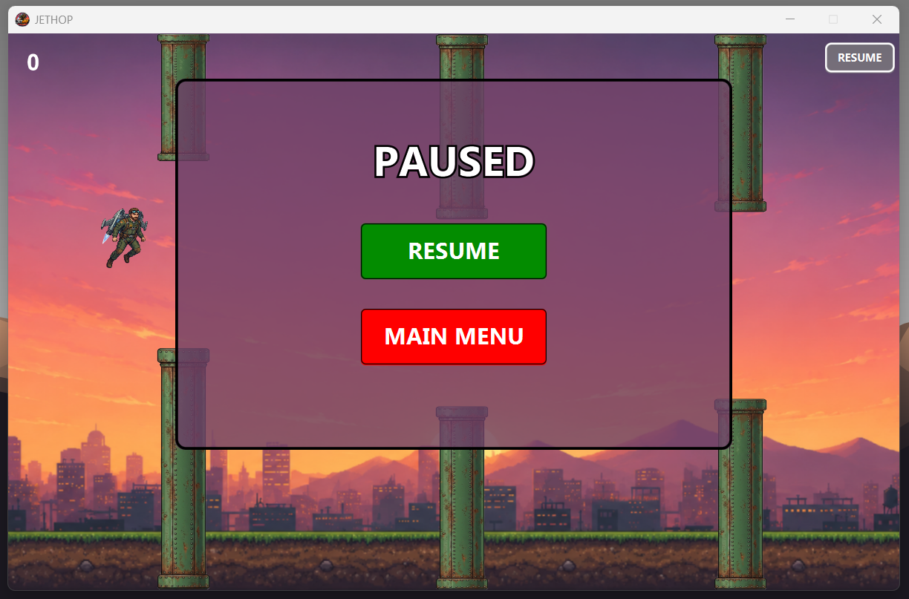
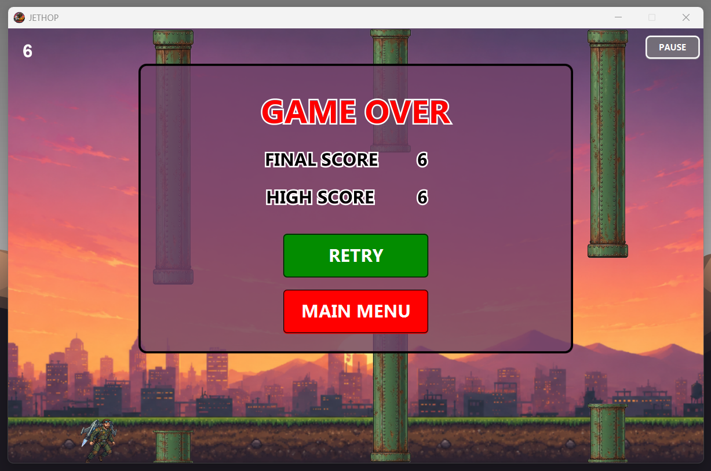

<p align="center">
  
</p>

<h1 align="center">JETHOP</h1>

<p align="center">
  A FlappyBird Style JavaFX Game built with JavaFX
</p>


## Overview

JETHOP is a 2D arcade-style game developed using Java and JavaFX. The player controls a character that must jump through moving obstacles while avoiding collisions. The objective is to survive as long as possible and achieve the highest score.

The game includes multiple character selections, background themes, difficulty levels, pause functionality, score tracking, and a game-over system.

---

## Screenshots

### Home Screen



### Gameplay



### Pause Menu



### Game Over Screen



---

## Features

- Built with JavaFX
- Smooth real-time gameplay using AnimationTimer
- Character selection system
- Multiple background scenes
- Three difficulty modes:
  - Easy
  - Medium
  - Hard
- Pause and resume functionality
- Score and high score tracking
- Game Over screen
- Retry option
- Main menu navigation

---

## Gameplay

1. Launch the game from the home screen.
2. Select a character.
3. Choose a background scene.
4. Select a difficulty level.
5. Click "Start Game".
6. Press the Space key to make the character jump.
7. Avoid colliding with pipes and the ground.
8. Earn points by successfully passing obstacles.
9. Try to beat the high score.

---

## Controls

| Key/Button | Action |
|------------|---------|
| Space | Jump |
| Esc | Pause / Resume |
| Start Game | Start a new game |
| Retry | Restart after Game Over |
| Main Menu | Return to home screen |
| Exit | Close the game |

---

## Technologies Used

- Java
- JavaFX
- FXML
- Object-Oriented Programming (OOP)

---

## Project Structure

```text
src/
└── main/
    ├── java/
    │   ├── module-info.java
    │   └── com/
    │       └── jethop/
    │           ├── App.java
    │           ├── JetHop.java
    │           └── Images/
    │               ├── JETHOP.png
    │               └── Pipe.png
    │
    └── resources/
        └── com/
            └── jethop/
                ├── BackgroundOne.png
                ├── BackgroundTwo.png
                ├── CharacterOne.png
                ├── CharacterTwo.png
                ├── HomeScreenBackground.png
                ├── HomeScreenWindow.fxml
                ├── PauseWindow.fxml
                └── GameOverWindow.fxml

```

---

## Difficulty Settings

### Easy
- Larger pipe gap
- Slower pipe speed
- Lower obstacle frequency

### Medium
- Balanced gameplay
- Moderate obstacle speed

### Hard
- Smaller pipe gap
- Faster obstacle movement
- More challenging gameplay

---

## Scoring System

- The player gains one point for each obstacle successfully passed.
- High score is stored during the application session.
- The highest score achieved is displayed on the menu and game-over screen.

---

## Requirements

- JDK 17 or later
- JavaFX SDK
- NetBeans, IntelliJ IDEA, VS COde or Eclipse

---


## Download & Play (Windows)

You do not need to install Java or a code editor to play the game! 

1. Go to the **[Releases](https://github.com/sadudoy/jethop-javafx-game/releases)** section of this repository.
2. Download the `JetHop-v1.0-Windows.zip` file under the Assets dropdown.
3. Extract the downloaded ZIP folder to your computer.
4. Double-click the `JetHop.exe` file to start playing immediately.

## Running the Project [For Developers]

### Clone the repository

```bash
git clone https://github.com/sadudoy/jethop-javafx-game.git
```

### Open the project

Import the project into your preferred Java IDE.

### Configure JavaFX

Add the JavaFX SDK to the project's libraries and VM options.

### Run

Execute:

```java
App.java
```

---

## Future Improvements

- Persistent high-score storage
- Sound effects and background music
- Online leaderboard
- Mobile version support

---

## Authors

**Sad Ibna Forid**
* Student ID: 0802510205101020

**Sohana Sinthia Rahman**
* Student ID: 0802510105101017

**Syed Sifat Al Sayeed**
* Student ID: 0802510405101041

**Ahmed Tahmid Tazowar Sachhya**
* Student ID: 0802510205101004

**Bangladesh Army University of Science & Technology, Saidpur**


GitHub Repository:

https://github.com/sadudoy/jethop-javafx-game

---

## License

This project was developed for CSE 2100 (Software Development Project I)